# Angels-NowPlaying

**Customizable now-playing overlays for OBS — free, open source, no subscription.**

Drop-in browser sources for [Tuna](https://github.com/univrsal/tuna). Pick a frame, tweak it in the visual editor, paste the URL or path into OBS, done.

[](https://github.com/angelicadvocate/Angels-NowPlaying/releases/latest)
[](https://github.com/angelicadvocate/Angels-NowPlaying/actions/workflows/release.yml)
[](https://github.com/angelicadvocate/Angels-NowPlaying/releases)
[](LICENSE)
[](https://tauri.app)

> ⚠️ **Pre-1.0 software.** Public releases work and are signed, but expect rough edges and the occasional breaking change. Auto-update is wired up but still maturing — if it ever fails to detect a newer build, grab it manually from [Releases](https://github.com/angelicadvocate/Angels-NowPlaying/releases).

---

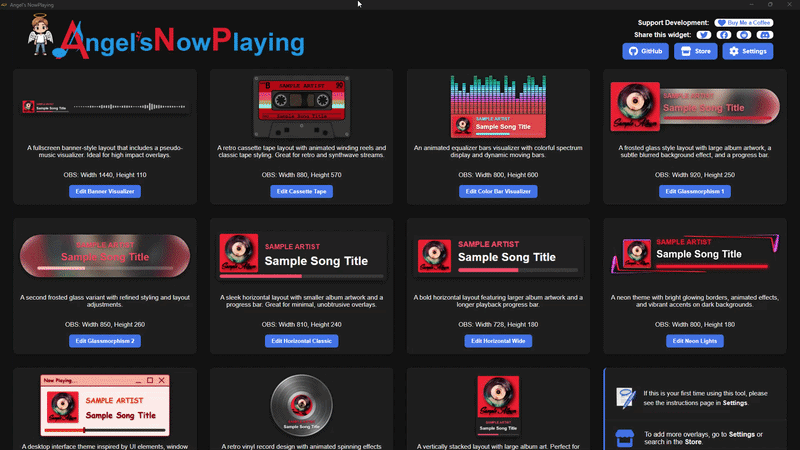

---

## Why use this?

**You should use Angels-NowPlaying if you want…**

- A now-playing overlay that doesn't require writing CSS.
- Multiple frame styles you can swap between without rebuilding your scene.
- A live editor preview so you can iterate without restarting OBS every time.
- Customizations that survive app updates (auto-snapshot/restore on every update).
- The option to share the overlay with OBS running on a different PC on your LAN.
- Source you can read, fork, or build your own frames against — overlays are plain HTML/CSS/JS folders.

**Skip it if…**

- You prefer rolling your own from scratch (the source is here for reference either way).
- You don't use Tuna — it's the data source. There's no Spotify-direct path; Tuna is the bridge.

---

## What it does

- Reads the currently playing track from **Tuna** — works with any source Tuna supports, including Spotify, Last.fm, YouTube Music Desktop App, Windows Media Player, MPD, local files via VLC, and more.
- Renders artist, track, album art, and a live progress bar. Bundled frames also do animated cassette reels, spinning vinyl, neon glow, scrolling marquee titles, and a few other styles — see the gallery below.
- The desktop app includes a per-overlay visual editor — adjust colours, fonts, layout, and animation parameters with sliders and pickers, and see changes in a live preview without touching OBS (see the demo above).
- Saves customizations per-overlay to the overlay's own folder, so reinstalling or updating the app doesn't lose your tweaks.
- Install custom overlays from a zip via Settings, or build your own using the provided starter template ([FRAME-DEVELOPMENT.md](docs/FRAME-DEVELOPMENT.md)).
- Optionally serves all your overlays over HTTP (loopback by default, LAN-wide if you opt in) so you can use **URL** Browser Sources in OBS instead of local file paths — useful when OBS runs on a different PC.

---

## Platform support

| Platform | Status |
|---|---|
| Windows | Primary dev/test platform. Use this if you can. |
| Linux   | CI builds produce a `.deb`, but behaviour has not been verified on real hardware yet. Reports welcome. |
| macOS   | CI builds produce a universal `.dmg`, but behaviour has not been verified on real Apple hardware yet. Reports welcome. |

---

## Requirements

| Dependency | Version | Notes |
|---|---|---|
| [OBS Studio](https://obsproject.com) | >=28.0 | |
| [Tuna](https://github.com/univrsal/tuna/releases) | >=1.9.9 | OBS plugin; provides the HTTP track-data endpoint |
| Music source | — | Any source [Tuna supports](https://github.com/univrsal/tuna/wiki) |

No Node.js or Rust installation is needed to **run** the app — just download the installer. See [DEVELOPMENT.md](docs/DEVELOPMENT.md) if you want to build from source.

---

## Installation

1. Download the latest release from [GitHub Releases](https://github.com/angelicadvocate/Angels-NowPlaying/releases/latest).
2. Run the installer (`.msi` on Windows) or extract the archive on Linux/macOS.
3. Launch **Angels-NowPlaying**.

---

## Setup

### 1. Configure Tuna

1. Install Tuna from the [releases page](https://github.com/univrsal/tuna/releases).
2. In OBS → **Tools → Tuna**, open the **Web server** tab and note the port (default **1608**).
3. Start the Tuna web server.
4. In Angels-NowPlaying → **Settings → Tuna Configuration**, confirm or set the port to match. **Note:** if you change the port *in Tuna*, fully quit and restart OBS — Tuna won't pick up the new port from a stop/start cycle.

### 2. Add an overlay to OBS (Local file)

1. Open Angels-NowPlaying and pick a frame from the home page.
2. Click **Copy Path** in the overlay editor to copy the local `main.html` path.
3. In OBS, add a **Browser Source** → pick **Local file** → paste the path → set width/height to the size shown in the editor.
4. Play music through any source Tuna is configured to read from. See [Tuna's source documentation](https://github.com/univrsal/tuna/wiki) for setup per source.
5. The overlay should appear with live track data within a couple of seconds.

### 2b. Use a URL instead (optional)

If OBS runs on a different PC, or you have a third-party overlay that needs `fetch()` against a real HTTP origin, enable **Settings → Serve overlays over HTTP**. The editor's **Copy Path** button becomes **Copy URL** and copies something like `http://192.168.x.y:8253/frame-cassette-tape/main.html`. Paste that into a Browser Source the same way — pick **URL** instead of **Local file**.

> The HTTP server is loopback-only by default. The LAN sub-toggle is off-by-default and shows an in-app security warning when enabled, since the server has no authentication.

### 3. Customise

1. Open the overlay's editor inside the app.
2. Adjust sliders and colour pickers — the preview updates live.
3. Click **Save** when you're happy. The change is written to the overlay's own folder; reload the OBS Browser Source to pick it up.

---

## Bundled overlays

The app ships with a starter set of frames covering a handful of styles. Pick whichever fits your stream's vibe — you can change it any time without rebuilding the OBS scene.

<table>
  <tr>
    <td align="center" width="33%">
      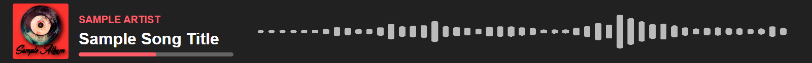
      <br/><b>Banner Visualizer</b><br/>
      Wide horizontal banner with bar-style audio visualizer.
    </td>
    <td align="center" width="33%">
      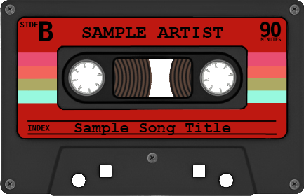
      <br/><b>Cassette Tape</b><br/>
      Retro cassette layout with animated winding reels.
    </td>
    <td align="center" width="33%">
      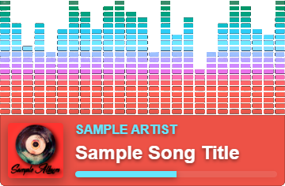
      <br/><b>Color Bar Visualizer</b><br/>
      Minimalist coloured-bar visualizer with track info.
    </td>
  </tr>
  <tr>
    <td align="center">
      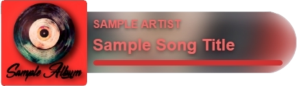
      <br/><b>Glassmorphism 1</b><br/>
      Modern frosted-glass panel, variant 1.
    </td>
    <td align="center">
      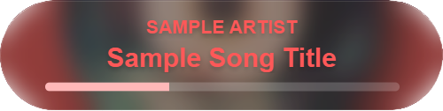
      <br/><b>Glassmorphism 2</b><br/>
      Modern frosted-glass panel, variant 2.
    </td>
    <td align="center">
      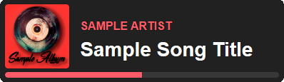
      <br/><b>Horizontal Classic</b><br/>
      Clean horizontal bar; a safe default.
    </td>
  </tr>
  <tr>
    <td align="center">
      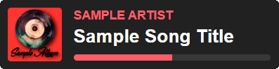
      <br/><b>Horizontal Wide</b><br/>
      Extra-wide horizontal layout with larger artwork.
    </td>
    <td align="center">
      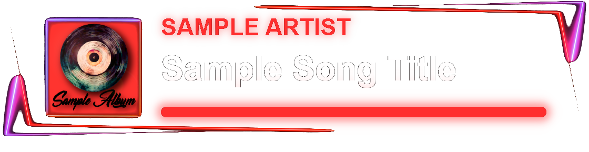
      <br/><b>Neon Lights</b><br/>
      Neon-glow aesthetic for synthwave / late-night streams.
    </td>
    <td align="center">
      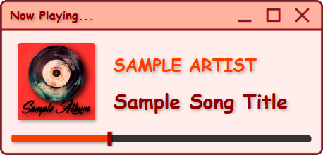
      <br/><b>Program Window</b><br/>
      Styled like a desktop app window.
    </td>
  </tr>
  <tr>
    <td align="center">
      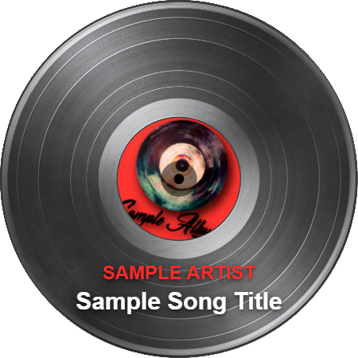
      <br/><b>Retro Vinyl</b><br/>
      Spinning vinyl record with track info on the sleeve.
    </td>
    <td align="center">
      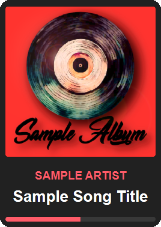
      <br/><b>Vertical Panel</b><br/>
      Narrow vertical layout for sidebars.
    </td>
    <td></td>
  </tr>
</table>

> Building your own frame? See the annotated [Frame Template Starter](docs/FRAME-DEVELOPMENT.md) as a starting point.

---

## Roadmap

A condensed view of what's coming. The full working list lives in [TODO.md](TODO.md).

- **Community overlay store** — browse and install community-contributed frames from inside the app. Catalogue plan in [STORE.md](docs/STORE.md).
- **Logging coverage + in-app log viewer** — a Settings panel that surfaces recent app events, useful for bug reports.
- **Modularization audit** — review long files (modal system, backend.rs, toast system) and split anything that's clearly reusable into its own module.
- **Cross-platform smoke test** — full end-to-end verification on macOS and Linux once hardware is available.

---

## Building from source

See [DEVELOPMENT.md](docs/DEVELOPMENT.md) for full instructions.

Quick start:

```bash
git clone https://github.com/angelicadvocate/Angels-NowPlaying.git
cd Angels-NowPlaying
npm install
cargo tauri dev
```

**Prerequisites:** [Node.js](https://nodejs.org), [Rust](https://rustup.rs), and the [Tauri v2 prerequisites](https://tauri.app/start/prerequisites/) for your platform.

---

## Creating custom overlays

Overlays are self-contained folders under `src/overlays/`. Each is a small HTML/CSS/JS app that runs in OBS and optionally exposes a visual editor inside the Angels-NowPlaying app.

See [FRAME-DEVELOPMENT.md](docs/FRAME-DEVELOPMENT.md) for the recommended workflow, file conventions, and the annotated `frame-template-starter` reference overlay.

---

## Contributing & feedback

Contributions are welcome — see [DEVELOPMENT.md](docs/DEVELOPMENT.md) for how to set up a dev build, the project structure, and the conventions used throughout the codebase. For overlay contributions specifically, read [FRAME-DEVELOPMENT.md](docs/FRAME-DEVELOPMENT.md) first.

- **Found a bug?** [Open an issue](https://github.com/angelicadvocate/Angels-NowPlaying/issues/new) — diagnostics output from **Settings → Diagnostics** is enormously helpful.
- **Have an idea?** Feature requests go in the same issue tracker; pick the relevant template.
- **Like the project?** [Star it on GitHub](https://github.com/angelicadvocate/Angels-NowPlaying) — it genuinely helps other streamers find it.

---

## License

[GPL-3.0](LICENSE) — see [LICENSES.md](LICENSES.md) for details, including overlay licensing and third-party components.
