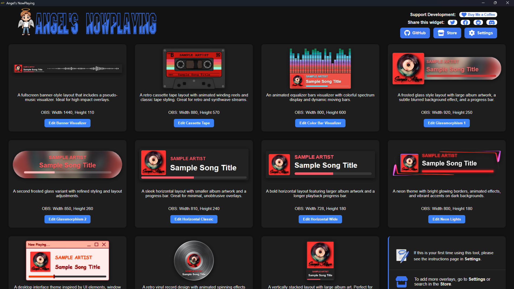

# Angels-NowPlaying

A cross-platform desktop app for managing and displaying **Now Playing** overlays in OBS. Built with [Tauri](https://tauri.app) (Rust backend) and plain HTML/CSS/JS overlays that run as OBS Browser Sources.

> **Status:** Active development — v0.9.5. Core overlay playback and the in-app editor are working. See [TODO.md](TODO.md) for what's in progress.

---



---

## Platform support

| Platform | Status |
|---|---|
| Windows | Developed and tested |
| Linux | Built and run-tested |
| macOS | CI builds produce a universal `.dmg`, but behavior has not been verified on real Apple hardware yet. Reports welcome. |

---

## What it does

- Reads the currently playing track from **Tuna** (OBS plugin) — works with any source Tuna supports, including Spotify, Last.fm, YouTube Music Desktop App, Windows Media Player, MPD, local files via VLC, and more
- Renders artist name, track title, album art, and a live progress bar in an OBS Browser Source
- Ships with multiple overlay styles (horizontal bars, vertical panels, glassmorphism, cassette tape, vinyl, and more)
- Includes a desktop app with a per-overlay visual editor — adjust colours, font sizes, and layout with sliders and see changes in a live preview without touching OBS and saves customizations for each overlay.
- **(Coming Soon)** Users can upload custom overlays via settings, or download user created overlays via the store.

---

## Requirements

| Dependency | Version | Notes |
|---|---|---|
| [OBS Studio](https://obsproject.com) | >=28.0 | |
| [Tuna](https://github.com/univrsal/tuna/releases) | >=1.9.9 | OBS plugin; provides the HTTP track data endpoint |
| Music source | — | Any source [Tuna supports](https://github.com/univrsal/tuna/wiki) — Spotify, Last.fm, YouTube Music Desktop App, VLC, Windows Media Player, MPD, and more |

No Node.js or Rust installation is needed to **run** the app. See [DEVELOPMENT.md](DEVELOPMENT.md) if you want to build from source.

---

## Installation

1. Download the latest release from [GitHub Releases](https://github.com/angelicadvocate/Angels-NowPlaying/releases).
2. Run the installer (`.msi` on Windows) or extract the archive.
3. Launch **Angels-NowPlaying**.

**Note: Releases are coming soon. Currently you must build from source.**

---

## Setup

### 1. Configure Tuna

1. Install Tuna from the [releases page](https://github.com/univrsal/tuna/releases).
2. In OBS -> **Tools -> Tuna**, go to the **Web server** tab and note the port (default **1608**).
3. Start the Tuna web server.
4. In Angels-NowPlaying -> **Settings -> Tuna Configuration**, confirm or set the port to match.

> If you change the port in Tuna you must fully restart OBS (not just stop/start Tuna) for the new port to take effect.

### 2. Add an overlay to OBS

1. Open Angels-NowPlaying and pick an overlay from the home page.
2. Click **Copy URL** in the overlay editor to copy the path to `main.html`.
3. In OBS, add a **Browser Source** -> Select local file -> paste the path -> set width/height to the size shown in the editor.
4. Play music through any source Tuna is configured to read from — Spotify, Last.fm, YouTube Music Desktop App, a VLC Video Source in OBS, and so on. See [Tuna's source documentation](https://github.com/univrsal/tuna/wiki) for setup instructions per source.
5. The overlay should appear with live track data within a couple of seconds.

### 3. Customise

1. Open the overlay's editor inside the app.
2. Adjust sliders and colour pickers — the preview updates live.
3. Click **Save** when done. The change is written directly to the overlay's `main.css`; reload the OBS Browser Source to pick it up.

---

## Building from source

See [DEVELOPMENT.md](DEVELOPMENT.md) for full instructions.

Quick start:

```bash
git clone https://github.com/angelicadvocate/Angels-NowPlaying.git
cd Angels-NowPlaying
npm install
cargo tauri dev
```

**Prerequisites:** [Node.js](https://nodejs.org), [Rust](https://rustup.rs), and the [Tauri v2 prerequisites](https://tauri.app/start/prerequisites/) for your platform.

---

## Creating custom overlays

Overlays are self-contained folders under `src/overlays/`. Each one is a small HTML/CSS/JS app that runs in OBS and optionally exposes a visual editor inside the Angels-NowPlaying app.

See [FRAME-DEVELOPMENT.md](FRAME-DEVELOPMENT.md) for the recommended workflow, file conventions, and the annotated `frame-template-starter` reference overlay.

---

## Contributing

Contributions are welcome — see [DEVELOPMENT.md](DEVELOPMENT.md) for how to set up a development build, the project structure, and the conventions used throughout the codebase.

For overlay contributions specifically, read [FRAME-DEVELOPMENT.md](FRAME-DEVELOPMENT.md) first.

---

## License

[GPL-3.0](LICENSE) — see [LICENSES.md](LICENSES.md) for details, including overlay licensing and third-party components.